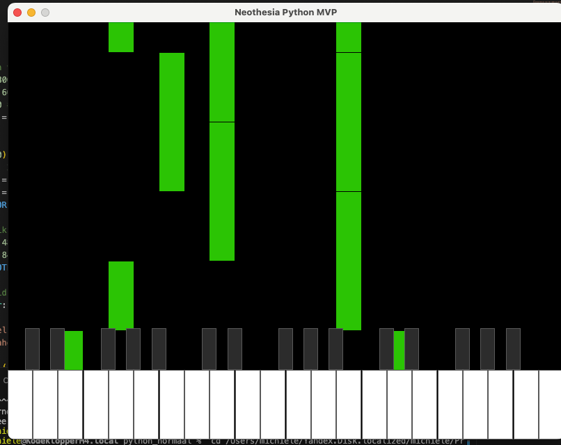

# Neothasia
Piano noten als watervalformaat.

Vibe coding experiment.

<br>

# Installatie
Je benodig minimaal <a href="https://python.org" target="_blank">python3.11</a> nodig.

```bash
pip install pygame mido python-rtmidi python-fluidsynth
```

Download <a href='https://github.com/mrbumpy409/GeneralUser-GS/blob/main/GeneralUser-GS.sf2'>GeneralUser-GS.sf2</a>

door: Michiel Erasmus
